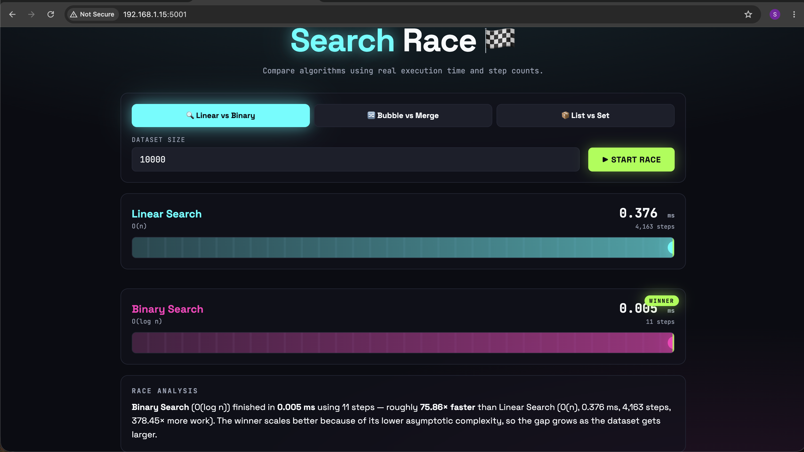

# Search Race 🏁

## Project Overview

Search Race is a Flask-based web application that compares the execution time and time complexity of different algorithms and data structures through an interactive frontend interface.

## Features

* Linear Search vs Binary Search
* Bubble Sort vs Merge Sort
* List Membership vs Set Membership
* Real-time execution time measurement
* Step count comparison
* Winner detection and race analysis
* Interactive and responsive UI

## Technologies Used

* Python
* Flask
* HTML5
* CSS3
* JavaScript

## Algorithms Used

### Search Algorithms

* Linear Search → O(n)
* Binary Search → O(log n)

### Sorting Algorithms

* Bubble Sort → O(n²)
* Merge Sort → O(n log n)

### Data Structure Comparison

* List Membership Check → O(n)
* Set Membership Check → O(1)

## Screenshots

### Algorithm Race Demo



## How It Works

1. Select a comparison mode.
2. Enter the dataset size.
3. Click **Start Race**.
4. The backend executes both algorithms.
5. Execution time and steps are measured using Python's `time.perf_counter()`.
6. Results are displayed and analyzed on the frontend.

## Project Structure

search-race/
├── app.py
├── requirements.txt
├── templates/
│   └── index.html
├── static/
│   ├── style.css
│   └── script.js
└── README.md

## Project Workflow

1. User selects a comparison mode.
2. User enters dataset size.
3. Flask backend generates data.
4. Algorithms execute and measure performance.
5. Results are returned to the frontend.
6. Race animation and analysis are displayed.

## Installation

```bash
pip install -r requirements.txt
python app.py
```

Open:

http://127.0.0.1:5001

## Usage

1. Launch the Flask application.
2. Open the application in your browser.
3. Choose a comparison mode.
4. Enter the dataset size.
5. Click Start Race.
6. Analyze the results and winner.

## Learning Outcomes

* Understanding algorithm efficiency
* Comparing time complexities
* Visualizing performance differences
* Using Flask for frontend-backend integration

## Challenges Faced

- Configuring Flask environment
- Managing GitHub repositories and commits
- Implementing algorithm visualizations
- Comparing execution times accurately

## Future Improvements

* Add more searching and sorting algorithms
* Visualize performance using charts
* Allow custom user datasets
* Export comparison reports
* Add algorithm complexity graphs

## Acknowledgements

This project was developed as part of the Data Structures and Algorithms course to demonstrate algorithm efficiency and time complexity analysis.
